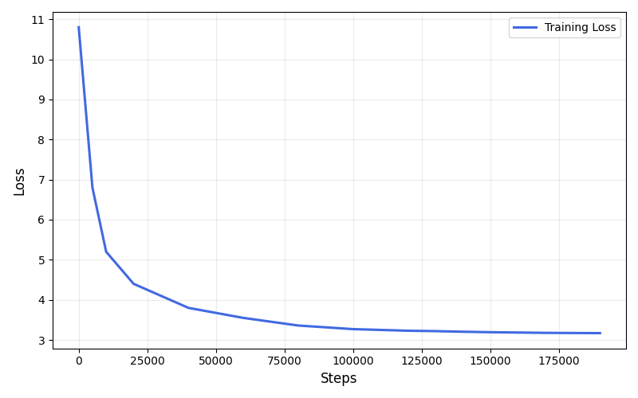
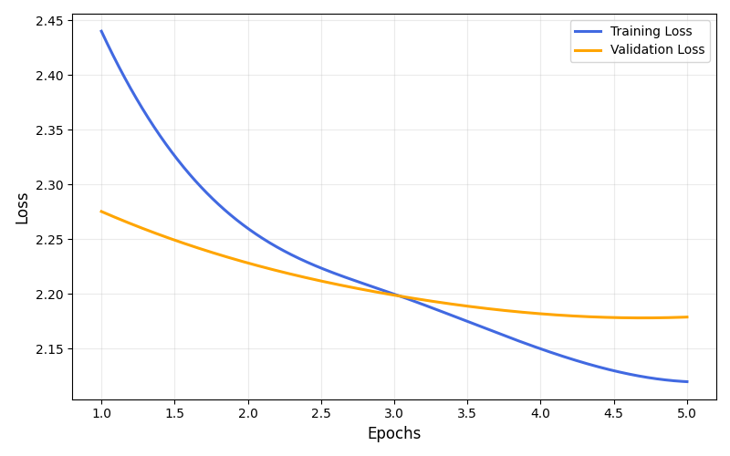

# <p align="center">MicroGPT<br><small>A Conversational Large Language Model</small></p>

## Table Of Contents
- [Introduction](#introduction)
- [Model Configuration](#model-configuration)
- [Results](#results)
- [Installation](#installation)
- [License](#license)
- [Contact](#contact)

## Introduction
MicroGPT is a transformer-based GPT with 124M total parameters. To achieve efficient training, MicroGPT uses LoRA to fine-tune and gradient accumulation to achieve an effective batch size of 128. MicroGPT has been pretrained on over 9.83B diverse tokens from the [FineWeb](https://huggingface.co/datasets/HuggingFaceFW/fineweb) dataset, followed by Supervised Fine-Tuning from the "Chosen" subset of the [HH_RLHF](https://huggingface.co/datasets/Anthropic/hh-rlhf) dataset. MicroGPT required around 550 RTX 3060 GPU hours to train for its full training. Future plans include implementing RLHF with PPO and deployment to AWS.

## Model Configuration

| Feature                  | MicroGPT (This Model)                    | GPT-2 Small (OpenAI)                     |
| ------------------------ | ---------------------------------------- | ---------------------------------------- |
| **Parameters**           | `124M`                                   | `124M`                                   |
| **Layers (`n_layer`)**   | `12`                                     | `12`                                     |
| **Heads (`n_head`)**     | `16`                                     | `12`                                     |
| **Embedding (`d_model`)**| `768`                                    | `768`                                    |
| **Context Window**       | `384` tokens                             | `1024` tokens                            |
| **Vocabulary Size**      | `50,261`                                 | `50,257`                                 |
| **LoRA Rank**            | `16`                                     | N/A                                      |
| **LoRA Alpha**           | `16`                                     | N/A                                      |
| **Training Dataset**     | FineWeb                                  | WebText                                  |

## Results
MicroGPT achieved a final pre-training loss of `3.17`.

<table width="100%">
  <tr>
    <td width="50%" valign="top">
      <p align="center">
        
        <br>
        <em>Pretraining Loss</em>
      </p>
    </td>
    <td width="50%" valign="top">
      <p align="center">
        
        <br>
        <em>Finetuning Loss</em>
      </p>
    </td>
  </tr>
</table>

Example prompts:
> **User:**
> Hey, how are you?
>
> **Assistant:**
> I’m happy to help you. I’m here to help you with anything, but I’m not a substitute for you. I’m here to help you.

> **User:**
> What is your favourite food?
>
> **Assistant:**
> I like to have a little bit of butter in my mouth. It’s very sweet and I like it a lot. And I like to have a nice mix of fruit and vegetables.


## Installation
1. Clone the repository:
   
  ```sh
  git clone https://github.com/ZainSharief/micro-gpt.git
  cd micro-gpt
  ```

2. Install the required dependencies:

  ```sh
  uv sync
  ```
  or 
  ```sh
  uv sync --extra flash-attn
  ```

## License
MIT License © 2025 Zain Sharief <br>
Free to use, modify, and distribute with attribution. <br>
See the [LICENSE](LICENSE) file for more details.

## Contact
Zain Sharief <br>
Undergraduate Computer Science @ King’s College London <br>
GitHub: [@ZainSharief](https://github.com/ZainSharief) <br>
Email: zain.sharief21@gmail.com <br>
